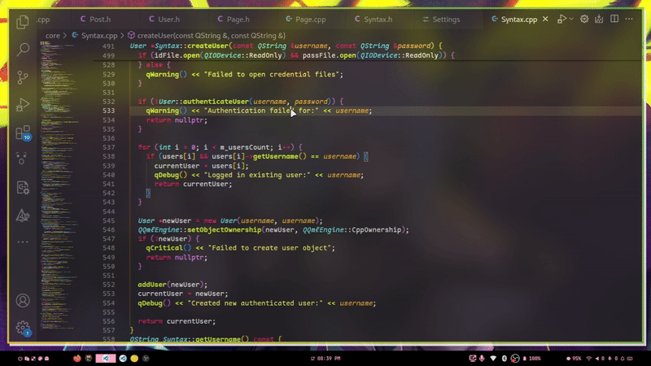

# QT/QML Log Remover

This Visual Studio Code extension removes all Qt log statements like `qDebug()`, `qWarning()`, `qCritical()`, and `qInfo()` from C++ source files.

## Features

- Removes **single-line and multi-line** Qt log statements.
- Supports `qDebug()`, `qWarning()`, `qCritical()`, and `qInfo()`.
- Automatically cleans up empty lines left behind.
- Right-click in the editor and select **"Remove Qt Logs"** to activate.

## Supported Formats

- C++ `.cpp`, `.h`, and `.qml` files using Qt logging macros.

## How to Use

1. Open a C++ or QML file.
2. Right-click anywhere in the editor.
3. Click **"Remove Qt Logs"** from the context menu.

## Demo

 <!-- Placeholder path; replace when actual GIF is ready -->

## Known Limitations

- Currently optimized for common log patterns.
- Some highly complex/macro-wrapped logs may require future enhancement.

---

Developed with ❤️ by [sanecodeguy](https://github.com/sanecodeguy)
